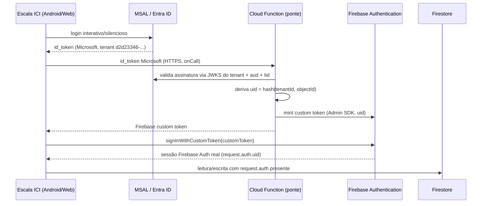

# SPEC 46 — Autenticação corporativa: MSAL + Firebase Authentication

**Status:** proposta; nenhuma linha de código funcional criada por esta spec
**Escopo:** Escala ICI KMP (Android + Web/PWA)
**Fase:** FASE 14a (documentação/auditoria) — implementação prevista para FASE 14b (MSAL/identidade) e FASE 14d (Firebase Auth/Rules)
**Não implementa:** MSAL, troca de token, Firebase Auth no app, Cloud Functions novas, Firestore Rules novas

## 1. Diagnóstico que motiva esta spec

Hoje o login do Escala ICI KMP é inteiramente mockado: a tela de entrada
(`ui/LoginGateScreen.kt`) sempre recusa o botão "Login" com a mensagem "Login
corporativo Microsoft ainda não disponível" e oferece um "Login de teste" que
escolhe entre 3 membros fixos, guardados em `InMemoryAuthSessionRepository`
sem nenhuma verificação de identidade. O Dashboard, por outro lado, já
autentica de verdade — mas via `OAuthProvider("microsoft.com")` nativo do
Firebase Auth (`client/src/lib/firebase.ts:51-62`), sem MSAL e sem nenhuma
ponte de token. O app Android legado `EscalaSOC` tem MSAL real
(`MicrosoftAuthManager.kt`), mas nenhuma sessão Firebase Auth. Nenhum dos três
clientes (Dashboard, EscalaSOC, KMP) e nenhuma das duas fontes de
autenticação (Firebase Auth nativo do Dashboard, MSAL do EscalaSOC) estão
conectados por uma ponte comum. Detalhe completo em
`.ai-runs/fase14a-diagnostico/DIAGNOSTICO-FASE14A.md`, itens 2, 13, 16, 17, 18.

**Urgência de calendário**: as regras Firestore hoje em produção liberam
leitura e escrita totalmente livres até **4 de agosto de 2026**
(`firebase/firestore.production.snapshot.rules:1-9`) — cerca de 3 semanas a
partir da data desta auditoria (14/07/2026). Nenhuma regra autenticada pode
ser publicada até que ao menos um caminho de autenticação real exista nos
clientes que hoje leem/escrevem sem token. Esta spec é o desenho necessário
para isso, não a implementação.

## 2. Decisão arquitetural central

MSAL (identidade corporativa / Microsoft Graph) e Firebase Authentication
(autorização de acesso ao Firestore) são **dois sistemas com propósitos
diferentes, ligados por uma ponte explícita — nunca um id_token Microsoft
tratado diretamente como um Firebase ID token.**

Por que não usar o id_token Microsoft diretamente: Firestore Rules só entende
tokens emitidos pelo próprio Firebase Auth (`request.auth`); um id_token do
Azure AD não é validável nativamente pelas Rules, e aceitar qualquer JWT que
"pareça" válido sem verificação de assinatura/emissor abriria falsificação
trivial. A ponte existe exatamente para fazer essa verificação uma vez, no
servidor, e nunca no cliente.

## 3. Arquitetura Android

- MSAL Android (`com.microsoft.identity.client:msal`, mesma família de
  versão usada pelo `EscalaSOC`, hoje `4.9.0` —
  `EscalaSOC/gradle/libs.versions.toml:13`), modo **single-account**
  (`ISingleAccountPublicClientApplication`), mesmo padrão do
  `MicrosoftAuthManager.kt` do EscalaSOC.
- App registration: **reaproveitar o mesmo já existente**
  (`client_id e5b5154d-e65e-4605-b221-73d7ee570580`,
  `tenant_id d2d23346-e737-4cac-96ec-fb25e7889f01`, tipo `AzureADMyOrg`,
  single-tenant) — não criar um app registration novo. Adicionar apenas uma
  segunda plataforma Android a esse registro (ver seção 8).
- Redirect URI própria do KMP lab, derivada do `applicationId`
  (`br.com.leorvergani.escalaici.kmp.lab`) + hash de assinatura do
  `escalaici-kmp-lab.jks`:
  `msauth://br.com.leorvergani.escalaici.kmp.lab/CNEvyhyc8lYTPFcNPDJzzJe1XyI%3D`
  (valor já calculado em `docs/PENDENCIAS-EXTERNAS.md:37-51`). Nunca
  reaproveitar a redirect URI do `EscalaSOC`
  (`br.com.leorvergani.escalasoc`) — hash de assinatura diferente, a
  Microsoft recusaria o retorno.
- `AndroidManifest.xml` precisa de uma `BrowserTabActivity` com
  `android:scheme="msauth"` `android:host="br.com.leorvergani.escalaici.kmp.lab"`
  `android:path="/CNEvyhyc8lYTPFcNPDJzzJe1XyI="`, mesmo padrão do EscalaSOC
  (`AndroidManifest.xml:65-77`).
- Arquivo `auth_config_single_account.json` próprio do KMP lab (não reaproveitar
  o do EscalaSOC), com o `client_id`/`tenant_id`/redirect_uri acima.

## 4. Arquitetura Web/PWA

- MSAL.js (`@azure/msal-browser`) com fluxo **popup ou redirect** (decisão
  final cabe à FASE 14b, não a esta spec) — `single-page application`
  registrada como uma **segunda plataforma** no mesmo app registration, com
  redirect URI própria do domínio de hospedagem do PWA (Cloudflare Pages,
  ver `docs/WEB-GITHUB-CLOUDFLARE.md`). Essa redirect URI ainda não existe e
  precisa ser cadastrada manualmente pelo dono da conta Entra quando a FASE
  14b for implementada.
- Cloudflare Access (`README.md:58`) protege a borda externa do site, mas não
  autentica o usuário dentro do código do app nem fornece nome/e-mail/token
  Microsoft automaticamente — MSAL.js continua necessário mesmo com Access
  habilitado.
- Cache de token: `sessionStorage`/`localStorage` conforme configuração do
  MSAL.js, nunca em texto plano além do que o próprio SDK já gerencia.

## 5. Login interativo, login silencioso, logout, expiração

- **Login interativo**: primeira autenticação, ou quando o silencioso falhar
  com erro que exige interação (mesma heurística do EscalaSOC —
  `MicrosoftAuthManager.kt:189-196`: `MsalException` ou mensagem contendo
  "consent"/"interaction"/"scope"/"token").
- **Login silencioso**: `acquireTokenSilent` tentado primeiro em toda
  reabertura do app com conta já cacheada; só cai para interativo se falhar.
- **Logout**: `signOut()` do MSAL limpa a conta local; deve também invalidar
  a sessão Firebase Auth local (`FirebaseAuth.signOut()`), nunca deixar as
  duas sessões dessincronizadas (usuário deslogado do MSAL mas ainda com
  sessão Firebase Auth ativa, ou vice-versa).
- **Expiração**: token Microsoft expira e é renovado silenciosamente pelo
  MSAL; o Firebase custom token, uma vez trocado por sessão real via
  `signInWithCustomToken`, segue o próprio ciclo de renovação do Firebase
  Auth (refresh automático pelo SDK) — não depende de o token Microsoft
  continuar válido para as chamadas Firestore subsequentes na mesma sessão,
  só a troca inicial exige o id_token Microsoft fresco.

## 6. Graph

Escopos necessários (mínimo, id_token/identidade apenas — este app não
precisa de OneDrive/SharePoint, que continua sendo fonte administrativa/
contingência, spec 48):
- `User.Read` — identidade e perfil básico (nome, e-mail), mesmo escopo
  mínimo usado pelo `EscalaSOC` para `IdentityScopes`
  (`MicrosoftAuthManager.kt:203-206`).

Se uma fase futura precisar de OneDrive real no Escala ICI (fora do escopo
desta spec), os escopos adicionais seriam `Files.Read.All`+`Sites.Read.All`,
mesmos do fluxo padrão do EscalaSOC.

## 7. A ponte segura (Cloud Function)

- **Entrada**: id_token Microsoft (JWT bruto), obtido pelo cliente via MSAL,
  enviado por uma chamada `onCall` HTTPS (Cloud Function, Admin SDK).
- **Validação obrigatória no servidor** (nunca confiar em claims não
  verificadas do cliente):
  1. Verificar assinatura do JWT contra as chaves públicas (JWKS) do tenant
     `d2d23346-e737-4cac-96ec-fb25e7889f01`.
  2. Validar `aud` (deve ser o `client_id e5b5154d-e65e-4605-b221-73d7ee570580`).
  3. Validar `tid` (deve bater com o tenant esperado — rejeitar qualquer
     outro tenant, mesmo que a assinatura seja válida).
  4. Validar `exp`/`nbf` (token não expirado, não usado antes da hora).
- **Derivação do UID Firebase**: `uid = hash(tenantId + ":" + objectId)` —
  nunca a partir de `name`/`preferred_username`/`email` (podem mudar; `oid`
  do Azure AD é estável por usuário dentro do tenant).
- **Emissão**: `admin.auth().createCustomToken(uid, { tenantId, objectId })`
  — claims extras só de identificação, nunca papel/permissão (isso vem de
  `user_links`/`dashboard_permissions`, spec 47, lido depois via Firestore,
  não embutido no token).
- **Nunca**: aceitar um token sem validar `tid`; aceitar um `client_id`
  diferente do esperado; confiar em qualquer campo enviado pelo cliente fora
  do próprio JWT assinado; reaproveitar a Cloud Function `confirmCoordinatorAccess`
  existente (`Dashboard/functions/index.js:16-40`) para este fim — ela resolve
  um problema diferente (custom claims pós-login) e está hoje órfã/não
  chamada por ninguém (`docs/28-DASHBOARD-AUTH-SEM-CLOUD-FUNCTIONS.md:38-42`);
  pode servir de referência de padrão de código, não de reaproveitamento
  direto.

## 8. Configurações externas necessárias (ação humana, fora do alcance de IA)

- Entra admin center → App registration `e5b5154d-e65e-4605-b221-73d7ee570580`
  → Authentication → **Add a platform → Android**: package name
  `br.com.leorvergani.escalaici.kmp.lab`, signature hash
  `CNEvyhyc8lYTPFcNPDJzzJe1XyI=` (já calculado, `docs/PENDENCIAS-EXTERNAS.md:41-49`).
- Entra admin center → mesmo app registration → Authentication → **Add a
  platform → Single-page application**: redirect URI do domínio Cloudflare
  Pages do Escala ICI Web (a definir na FASE 14b, depende de qual domínio
  final for escolhido).
- Firebase Console → habilitar Cloud Functions (billing Blaze, se ainda não
  habilitado) para a função de troca de token.
- Nenhuma dessas ações deve ser tentada por uma IA/sessão automatizada —
  todas exigem login humano nos respectivos consoles.

## 9. Segurança

- Nunca embutir `client_secret` no app — MSAL Android/Web usa sempre fluxo de
  cliente público (mesmo padrão do EscalaSOC, confirmado sem secret em
  nenhum arquivo).
- Nunca persistir o id_token Microsoft bruto além do necessário para a troca
  imediata pela Cloud Function.
- Tokens/segredos de sessão (custom token, sessão Firebase) devem usar
  armazenamento criptografado no Android (`EncryptedSharedPreferences` ou
  Android Keystore) desde o início — o `EscalaSOC` tem uma dívida técnica
  real e já documentada no próprio código (`AdminDropboxRepository.kt:29,154`,
  comentários `TODO: migrar para armazenamento criptografado`) que não deve
  ser repetida no Escala ICI.
- A Cloud Function de troca de token deve logar tentativas de validação
  falha (assinatura inválida, `tid` incorreto) para auditoria, sem logar o
  JWT completo.

## 10. Erros

Estados tipados (reaproveitados/alinhados com a spec 48, seção "Estados"):
- `AUTH_REQUIRED` — nenhuma sessão MSAL nem Firebase ativa.
- Falha de login interativo cancelado pelo usuário — não é erro, retorna ao
  estado anterior sem mensagem de erro.
- Falha de rede durante login — mensagem específica, nunca a mensagem
  genérica hoje usada em `FirebaseSources.kt` (ver diagnóstico item 7); esta
  spec exige diferenciar "sem rede durante login" de "token inválido/recusado
  pela ponte" de "usuário sem vínculo" (`IDENTITY_NOT_LINKED`, spec 47).
- Falha da ponte (token Microsoft rejeitado pela Cloud Function) — mensagem
  explícita ao usuário, nunca silenciosa, com orientação de contatar o
  administrador se persistir.

## 11. Offline

- Uma sessão Firebase Auth já trocada continua válida offline pelo tempo de
  vida do token local (o SDK Firebase Auth cacheia e renova quando a rede
  volta) — o app deve continuar funcionando com o cache local (spec 48)
  mesmo sem conseguir renovar a sessão imediatamente.
- Login inicial (primeira vez, sem sessão prévia) exige rede — não há como
  autenticar offline pela primeira vez.

## 12. Testes

- Unitário: função pura de derivação de UID (`hash(tenantId, objectId)`)
  determinística e estável.
- Unitário (Cloud Function, ambiente de teste): rejeição de token com `aud`
  errado, `tid` errado, assinatura inválida, token expirado.
- Integração (Emulator Firebase Auth + Firestore): fluxo completo
  custom-token → `signInWithCustomToken` → leitura autorizada por
  `request.auth.uid`.
- Manual (Android real, após FASE 14b implementada): login interativo,
  login silencioso após reabrir o app, logout, revogação de sessão do lado
  do Entra refletindo no próximo login.

## 13. Critérios de aceite (para quando a FASE 14b/14d implementarem isto)

1. Nenhum id_token Microsoft é usado como Firebase ID token em nenhum ponto
   do código — sempre passa pela Cloud Function de troca.
2. A Cloud Function valida assinatura, `aud` e `tid` antes de mintar
   qualquer custom token.
3. O UID Firebase é derivado de `tenantId`+`objectId`, nunca de nome/e-mail.
4. Login interativo, silencioso e logout funcionam em Android; Web fica
   registrado como pendente de implementação com plano claro.
5. Nenhum `client_secret` aparece em nenhum artefato do app (APK, bundle
   Web, repositório).
6. Tokens de sessão usam armazenamento criptografado no Android.
7. Todos os erros de autenticação têm mensagem específica, nunca a mensagem
   genérica de "não foi possível atualizar".
