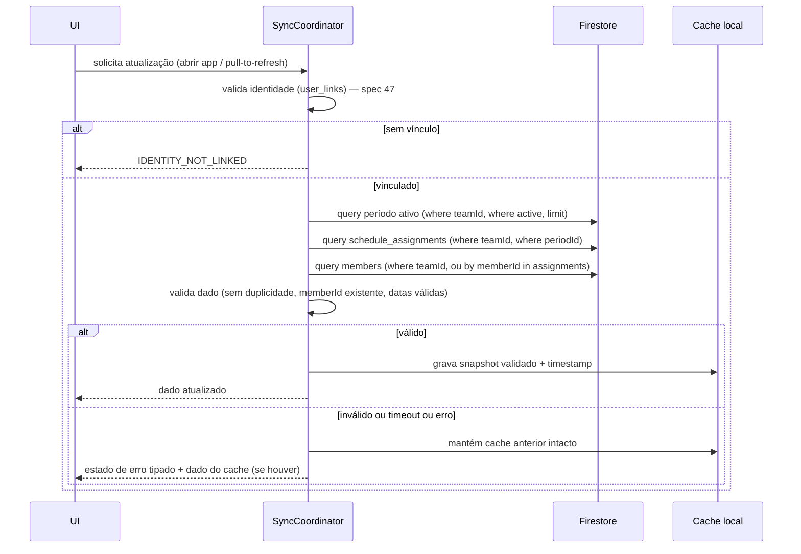

# SPEC 48 — Sincronização de escala, cache e comportamento offline

**Status:** proposta; nenhuma linha de código funcional criada por esta spec
**Escopo:** Escala ICI KMP (Android + Web/PWA), camada `source`/`repository`
**Fase:** FASE 14a (documentação) — implementação prevista para FASE 14e
**Depende de:** SPEC 46 (identidade) e SPEC 47 (`user_links`, `teamId` real em vez de `"soc"` hardcoded)

## 1. Diagnóstico que motiva esta spec

A sincronização atual tem três problemas estruturais confirmados por leitura
direta do código (`FirestoreRestGateway.kt`, `FirebaseSources.kt`):

1. **Sem query server-side**: `loadActiveSchedulePeriod`/`loadScheduleAssignments`/
   `loadOnCallAssignments` buscam a coleção inteira (`GET .../documents/{collection}?pageSize=1000`)
   e filtram no cliente por `teamId`/`periodId`/`active` — não escala, e lança
   erro se houver mais de 1000 documentos (`FirestoreRestGateway.kt:52-55`).
2. **Erros colapsados**: qualquer exceção (rede, parsing, validação de
   negócio) cai num único `catch (_: Throwable)` que gera sempre a mesma
   mensagem genérica ("Não foi possível atualizar a escala/plantão. Tente
   novamente.") — usuário e suporte não conseguem diferenciar "sem internet"
   de "sem permissão" de "dado publicado incorreto".
3. **`teamId` hardcoded `"soc"`** (`ui/App.kt:124,166`) — a sincronização não
   depende ainda de identidade real (resolve com a SPEC 47).

O cache, por outro lado, já tem uma política correta e intencional que esta
spec preserva: falha remota nunca apaga o cache existente
(`docs/FIREBASE-FIRESTORE-MAPEAMENTO.md:201-202`, `docs/FONTES-UNIVERSAIS.md:39`).

## 2. Sequência de sincronização

## 3. Período ativo, assignments e plantão

- Migrar de "buscar tudo e filtrar no cliente" para **query Firestore real**
  com `where("teamId", "==", teamId)`, `where("active", "==", true)`, ordenado
  por `updatedAt` descendente, `limit(1)` para o período ativo — elimina o
  limite de 1000 documentos e a filtragem client-side.
- `schedule_assignments`/`oncall_assignments`: query por
  `where("teamId", "==", teamId).where("periodId", "==", periodId)` — mesmo
  princípio.
- `teamId` deixa de ser hardcoded — vem da resolução de identidade (SPEC 47:
  `user_links.primaryTeamId` ou equipe selecionada pelo usuário entre as
  `teamIds` disponíveis).
- Índices compostos Firestore correspondentes precisam existir
  (`firestore.indexes.json`) — a criar na FASE 14e, não nesta fase.

## 4. Cache

- Mantém a arquitetura atual de dois caches independentes (cache de arquivo
  importado, cache Firebase) — não unificar, propósitos diferentes
  (import manual vs. sincronização automática).
- Cache Firebase só é escrito **após validação completa** do snapshot (regra
  já existente, preservar): sem assignments vazios, sem duplicidade por
  `assignmentId`/`memberId+date`, todo `memberId` presente em `members`.
- **Atualização incremental**: quando suportado pelo backend (Firestore
  `onSnapshot`/listeners, ou polling com `updatedAt` maior que o do cache),
  preferir atualizar apenas o que mudou em vez de recarregar tudo — decisão
  de mecanismo exato (listener real-time vs. polling) cabe à FASE 14e,
  condicionado à necessidade real de atualização em tempo real vs. custo de leitura.
- **Atualização manual**: usuário pode forçar refresh (pull-to-refresh ou
  botão) — sempre permitida, sempre respeita a mesma validação antes de
  substituir o cache.

## 5. Retry, timeout, cancelamento de chamadas obsoletas

- Toda chamada de rede tem timeout explícito (a definir em ms na
  implementação, recomendado 10-15s dado o padrão de UX já usado no app) —
  hoje não há timeout configurado explicitamente no `FirestoreRestGateway`.
- Retry automático **limitado** (ex.: 1 retry silencioso em erro de rede
  transitório) — nunca retry infinito, nunca retry em erro de permissão ou
  dado inválido (esses não se resolvem tentando de novo).
- **Cancelamento de chamadas obsoletas**: se o usuário trocar de equipe ou
  fechar a tela antes da resposta anterior chegar, a resposta antiga deve
  ser descartada (mesmo padrão de guarda `ignore`/cleanup já corrigido no
  Dashboard nesta mesma sessão de trabalho, ver
  `client/src/components/ScheduleWizardDialog.tsx` como referência de padrão
  a seguir, adaptado à camada de coroutines/Flow do KMP — `Job.cancel()` ou
  guarda equivalente por escopo de composição).

## 6. Atomicidade

- Um snapshot (período + assignments + members, ou período + oncall +
  members) é tratado como uma unidade atômica do ponto de vista do cache:
  nunca gravar período novo com assignments do período anterior, ou
  vice-versa — a validação de "assignment referencia período/membro
  existente" (já implementada) é o mecanismo que garante isso; esta spec
  formaliza que ela nunca deve ser removida/enfraquecida.

## 7. Estados tipados de erro

Substituindo o `catch (_: Throwable)` genérico atual por estados explícitos,
propagados até a UI:

| Estado | Significado | Mensagem sugerida ao usuário |
|---|---|---|
| `AUTH_REQUIRED` | Sem sessão Firebase Auth ativa | "Faça login para continuar." |
| `IDENTITY_NOT_LINKED` | Sessão ativa, sem `user_links` ativo (spec 47) | "Sua conta ainda não foi associada a um colaborador. Contate o administrador." |
| `TEAM_NOT_FOUND` | `teamId` vinculado não existe mais/inativo | "A equipe associada à sua conta não foi encontrada. Contate o administrador." |
| `NO_ACTIVE_PERIOD` | Consulta OK, nenhum período com `active == true` | "Nenhuma escala publicada no momento para sua equipe." |
| `NO_ASSIGNMENTS` | Período ativo existe, sem atribuições para o membro | "Você não possui atribuições nesta escala." |
| `PERMISSION_DENIED` | Firestore Rules recusaram a leitura | "Sem permissão para acessar esta escala. Contate o administrador." |
| `NETWORK_ERROR` | Falha de conectividade/timeout | "Sem conexão. Mostrando os últimos dados salvos." (se houver cache) |
| `INVALID_REMOTE_DATA` | Dado remoto falhou validação (duplicidade, membro inexistente) | "A escala publicada contém um erro. Contate o administrador." + log técnico |
| `CACHE_AVAILABLE` | Não é erro — indica que a tela está mostrando dado de cache (por escolha ou por erro anterior) | Selo visual "dado salvo localmente", com timestamp |

- Cada estado é um valor de um `sealed class`/enum próprio, nunca uma string
  livre — permite tratamento de UI específico por estado (ex.: `NETWORK_ERROR`
  mostra cache se houver; `AUTH_REQUIRED` redireciona para login;
  `IDENTITY_NOT_LINKED` nunca mostra cache de outro usuário).
- **Nunca reintroduzir uma mensagem genérica única** cobrindo mais de um
  desses estados — essa era exatamente a falha identificada no diagnóstico
  (item 7).

## 8. Funcionamento offline

- Com cache disponível: app funciona normalmente em modo leitura, com selo
  visual indicando que o dado é local e a data/hora da última sincronização
  bem-sucedida.
- Sem cache disponível e sem rede: estado `NETWORK_ERROR` sem fallback,
  mensagem clara de que é necessário conectar ao menos uma vez.
- Ações que exigem escrita (ex.: confirmar troca de turno, feature futura)
  nunca são permitidas offline — sempre bloqueadas com mensagem explícita,
  nunca enfileiradas silenciosamente sem que o usuário saiba (fora de escopo
  desta fase detalhar uma fila de sincronização de escrita; se implementada
  no futuro, precisa de spec própria).

## 9. Proteção contra cache corrompido

- Ao carregar o cache, validar o schema completo (todos os campos
  obrigatórios presentes, tipos corretos) antes de usar — nunca assumir que
  o JSON salvo está no formato esperado só porque parseou sem erro (mesmo
  princípio just corrigido no Dashboard: mesclar com defaults/validar campo a
  campo em vez de checar só 1-2 campos superficiais).
- Cache corrompido/schema incompatível: tratar como cache ausente
  (`CACHE_AVAILABLE = false`), nunca crashar, nunca apagar o cache antigo
  automaticamente (preserva para diagnóstico manual, mesma política já
  adotada para dado remoto inválido).

## 10. Critérios de aceite

1. Toda consulta a `schedule_periods`/`schedule_assignments`/
   `oncall_periods`/`oncall_assignments` usa `where` no servidor, nunca
   busca-tudo-e-filtra no cliente.
2. `teamId` vem da identidade resolvida (SPEC 47), nunca hardcoded.
3. Todo erro é um dos estados tipados da seção 7 — nenhuma mensagem genérica
   cobrindo mais de uma causa.
4. Falha remota nunca apaga cache existente (mantém comportamento atual).
5. Cache corrompido nunca derruba a tela — sempre tratado como ausente.
6. Chamada obsoleta (equipe trocada/tela fechada) nunca sobrescreve estado
   com dado da equipe/tela anterior.
7. Existe timeout explícito e retry limitado (não infinito) em toda chamada
   de rede desta camada.
