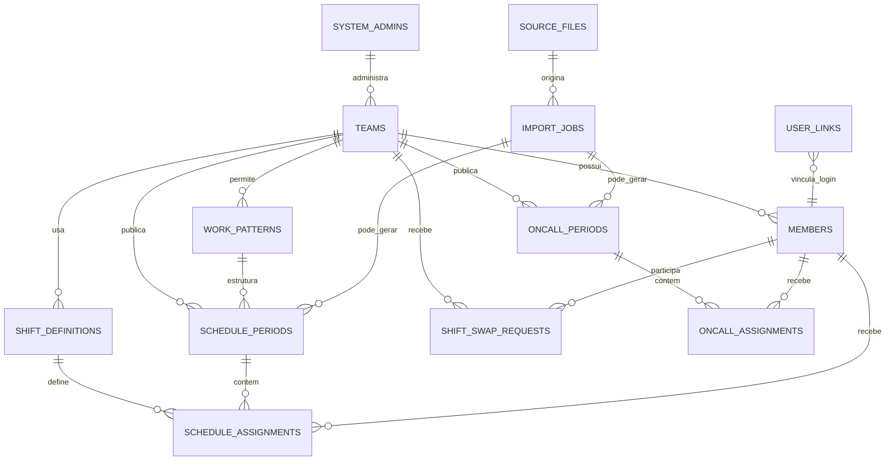
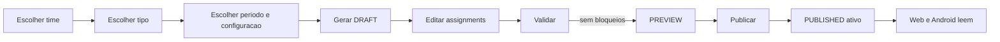

# SPEC — Banco Universal do Escala ICI

**Status:** proposta pronta para implementação incremental
**Escopo:** Dashboard React + Escala ICI KMP Web/PWA/Android + futuro iOS
**Objetivo:** manter o banco atual, evitar coleções duplicadas e suportar vários times e tipos de escala sem reescrever os aplicativos.

## 1. Princípios

- Preservar as coleções atuais.
- Não criar coleções paralelas `usuarios`, `times` ou `escalas`.
- Dashboard edita e publica.
- Web/PWA e Android leem.
- Novos documentos usam `schemaVersion = 2`.
- Leitores continuam aceitando documentos antigos.
- Time e tipo de escala nunca ficam hard-coded na UI.
- Datas de calendário usam `YYYY-MM-DD`.
- Timestamps técnicos usam Firestore Timestamp.

## 2. Tipos oficiais

| Código | Nome |
|---|---|
| `SIX_BY_ONE` | 6x1 |
| `TWELVE_BY_THIRTY_SIX` | 12x36 |
| `BUSINESS_HOURS` | Horário comercial |
| `ON_CALL` | Plantão |

## 3. Diagrama



## 4. Coleções

### `teams`

Representa SOC, NOC, Redes, Segurança e novos times.

```json
{
  "name": "SOC",
  "code": "SOC",
  "sectorName": "Segurança da Informação",
  "active": true,
  "managerUids": ["firebase_uid_1"],
  "allowedScheduleTypes": ["SIX_BY_ONE", "ON_CALL"],
  "defaultScheduleType": "SIX_BY_ONE",
  "defaultWorkPatternId": "soc_6x1_default",
  "schemaVersion": 2,
  "createdAt": "timestamp",
  "updatedAt": "timestamp"
}
```

Regras:

- `managerUids` aceita mais de um responsável.
- Um responsável pode aparecer em vários times.
- `allowedScheduleTypes` controla as opções do Dashboard.
- O tipo não deve ser inferido pelo nome do time.

### `members`

```json
{
  "name": "Leonardo Vergani",
  "displayRole": "Analista de SOC",
  "roleCode": "SOC_ANALYST",
  "primaryTeamId": "soc",
  "teamIds": ["soc"],
  "active": true,
  "schemaVersion": 2,
  "createdAt": "timestamp",
  "updatedAt": "timestamp"
}
```

Regras:

- `teamIds` permite participação em mais de um time.
- `primaryTeamId` define o time inicial.
- E-mail remoto não é necessário para renderizar a escala.
- Dados sensíveis não devem ficar nessa coleção.

### `user_links` — etapa posterior

Documento: `user_links/{firebaseUid}`

```json
{
  "memberId": "lvergani",
  "teamIds": ["soc"],
  "active": true,
  "createdAt": "timestamp",
  "updatedAt": "timestamp"
}
```

Vincula Firebase Auth/Microsoft ao membro interno sem mudar os IDs atuais.

### `work_patterns`

Template de geração.

```json
{
  "name": "SOC 6x1 padrão",
  "type": "SIX_BY_ONE",
  "teamId": "soc",
  "active": true,
  "shiftDefinitionIds": [
    "soc_morning",
    "soc_afternoon",
    "soc_night",
    "soc_early_morning"
  ],
  "generatorConfig": {
    "workDays": 6,
    "restDays": 1,
    "minimumRestHours": 11,
    "copyPreviousPeriodAllowed": true
  },
  "schemaVersion": 2
}
```

Configuração mínima por tipo:

- `SIX_BY_ONE`: `workDays`, `restDays`, `minimumRestHours`.
- `TWELVE_BY_THIRTY_SIX`: `workHours`, `restHours`, `requiresAnchorDate`.
- `BUSINESS_HOURS`: dias úteis, entrada, saída, intervalo, fins de semana.
- `ON_CALL`: início/fim completos e permissão para atravessar meia-noite.

### `shift_definitions`

```json
{
  "teamId": "soc",
  "code": "AFTERNOON",
  "name": "Tarde",
  "startTime": "13:00",
  "endTime": "19:00",
  "crossesMidnight": false,
  "countsAsWork": true,
  "active": true,
  "sortOrder": 2,
  "schemaVersion": 2
}
```

Turnos iniciais do SOC:

| Nome | Início | Fim |
|---|---:|---:|
| Manhã | 07:00 | 13:00 |
| Tarde | 13:00 | 19:00 |
| Noite | 19:00 | 01:00 |
| Madrugada | 01:00 | 07:00 |

### `schedule_periods`

```json
{
  "teamId": "soc",
  "workPatternId": "soc_6x1_default",
  "scheduleType": "SIX_BY_ONE",
  "startDate": "2026-07-26",
  "endDate": "2026-08-25",
  "status": "PUBLISHED",
  "active": true,
  "source": "DASHBOARD",
  "schemaVersion": 2,
  "createdAt": "timestamp",
  "updatedAt": "timestamp",
  "publishedAt": "timestamp"
}
```

Estados:

```text
DRAFT
PREVIEW
PUBLISHED
ARCHIVED
```

Regras:

- apenas um período publicado e ativo por time e tipo;
- nova publicação arquiva o anterior;
- assignments ficam em coleção separada;
- novos períodos gravam `scheduleType`.

### `schedule_assignments`

```json
{
  "periodId": "soc_20260726_20260825",
  "teamId": "soc",
  "memberId": "lvergani",
  "date": "2026-07-28",
  "assignmentType": "WORK_SHIFT",
  "shiftDefinitionId": "soc_afternoon",
  "shiftType": "AFTERNOON",
  "activityCode": null,
  "status": "CONFIRMED",
  "schemaVersion": 2,
  "updatedAt": "timestamp"
}
```

`assignmentType`:

```text
WORK_SHIFT
OFF
VACATION
ABSENCE
TRAINING
OTHER
```

Chave lógica única:

```text
periodId + memberId + date
```

### `oncall_periods`

```json
{
  "teamId": "seguranca",
  "scheduleType": "ON_CALL",
  "startDate": "2026-07-01",
  "endDate": "2026-07-31",
  "status": "PUBLISHED",
  "active": true,
  "schemaVersion": 2,
  "publishedAt": "timestamp"
}
```

### `oncall_assignments`

```json
{
  "periodId": "plantao_seguranca_202607",
  "teamId": "seguranca",
  "memberId": "member_01",
  "startDate": "2026-07-14",
  "startTime": "18:00",
  "endDate": "2026-07-15",
  "endTime": "08:00",
  "status": "CONFIRMED",
  "schemaVersion": 2
}
```

Regras:

- início e fim completos são obrigatórios;
- atravessar dia, mês ou ano é permitido;
- conflito de plantão é validado;
- falha no plantão não invalida a escala normal.

### `shift_swap_requests`

```json
{
  "teamId": "soc",
  "requesterMemberId": "member_a",
  "recipientMemberId": "member_b",
  "requesterAssignmentId": "assignment_a",
  "recipientAssignmentId": "assignment_b",
  "managerUids": ["firebase_uid_manager"],
  "status": "PENDING_RECIPIENT",
  "createdAt": "timestamp",
  "recipientRespondedAt": null,
  "managerRespondedAt": null,
  "approvedByUid": null,
  "schemaVersion": 2
}
```

Estados:

```text
PENDING_RECIPIENT
PENDING_MANAGER
APPROVED
REJECTED_BY_RECIPIENT
REJECTED_BY_MANAGER
CANCELLED
```

A escala permanece inalterada durante a solicitação. A troca final altera os dois assignments e a solicitação na mesma transação.

### `source_files`

Registra arquivos importados.

### `import_jobs`

Audita importação, preview, warnings e período gerado.

### `system_admins`

Documento por Firebase UID com `active` e `role`.

## 5. Fluxo de publicação



## 6. Matriz inicial configurável

| Time | Tipos iniciais sugeridos |
|---|---|
| SOC | 6x1, Plantão |
| NOC | 12x36, Plantão |
| Redes | Horário comercial, Plantão |
| Segurança | Horário comercial, 6x1, Plantão |

O Dashboard lê isso de `teams.allowedScheduleTypes`.

## 7. Compatibilidade KMP

O KMP reconhece:

```text
teamId
scheduleType
workPatternId
shiftDefinitionId
periodId
assignmentType
schemaVersion
```

- 6x1, 12x36 e horário comercial usam calendário mensal.
- Plantão usa a tela própria e aparece resumido em Hoje.
- Cores e rótulos vêm de `shift_definitions`.
- O app não deve assumir SOC.

## 8. Alertas mínimos

### 6x1

- mais de 6 dias consecutivos;
- descanso inferior ao mínimo;
- duplicidade;
- turno incompatível.

### 12x36

- descanso inferior a 36h;
- sobreposição;
- âncora ausente;
- duplicidade.

### Horário comercial

- assignment em fim de semana quando proibido;
- horário fora do modelo;
- duplicidade.

### Plantão

- fim anterior ao início;
- sobreposição;
- membro ausente;
- plantão fora do período.

## 9. Índices esperados

```text
schedule_periods: teamId + active + status
schedule_assignments: periodId + teamId + date
schedule_assignments: periodId + memberId + date
oncall_periods: teamId + active + status
oncall_assignments: periodId + memberId + startDate
shift_swap_requests: recipientMemberId + status
shift_swap_requests: managerUids array-contains + status
members: teamIds array-contains + active
```

Registrar somente os índices exigidos pelas queries reais.

## 10. Migração

1. Não apagar coleções atuais.
2. Novos documentos usam `schemaVersion = 2`.
3. Leitores aceitam documentos antigos.
4. O Dashboard começa a gravar `scheduleType`.
5. Migração em massa fica para depois.
6. Cache válido nunca é apagado por documento incompatível.

## 11. Critérios de aceite

- Times vêm do Firestore.
- Tipos são configuráveis por time.
- Escala normal usa `schedule_periods` e `schedule_assignments`.
- Plantão usa `oncall_periods` e `oncall_assignments`.
- Web e Android leem os quatro tipos.
- Nenhuma coleção duplicada é criada.
- Arquivo local e cache continuam funcionando.
- Períodos antigos continuam legíveis.
- Nenhuma escrita é feita pelo KMP na fase atual.
